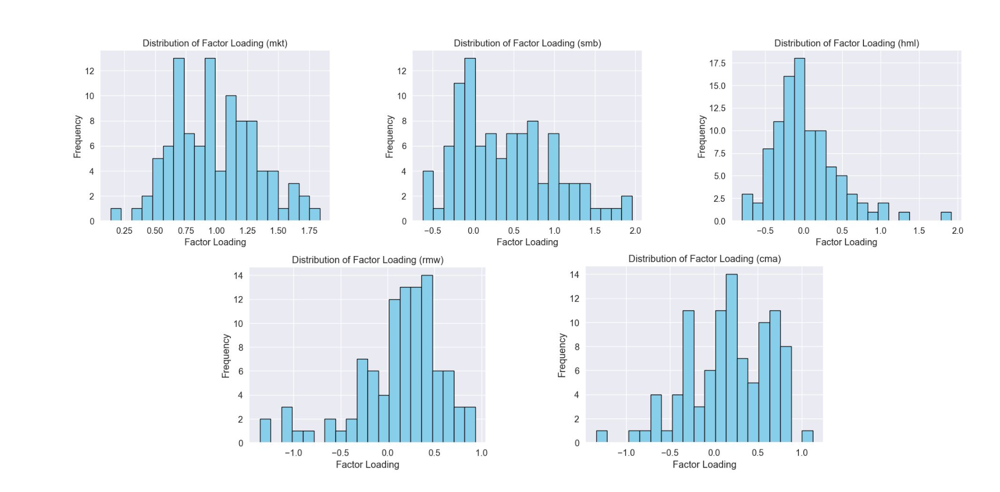
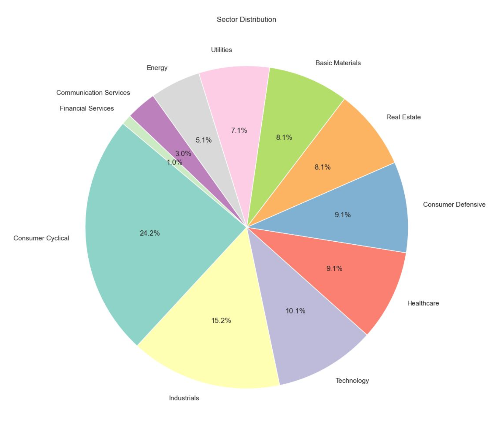
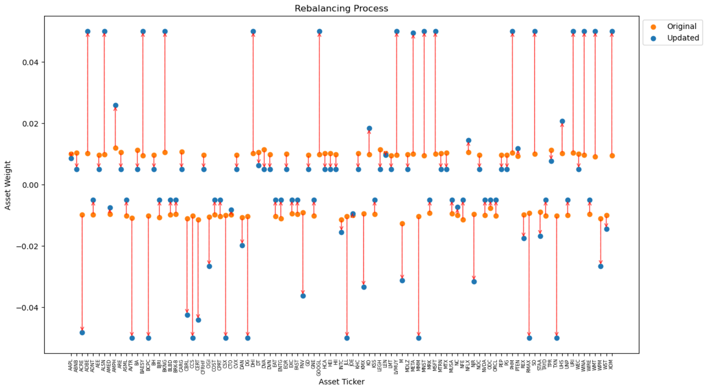
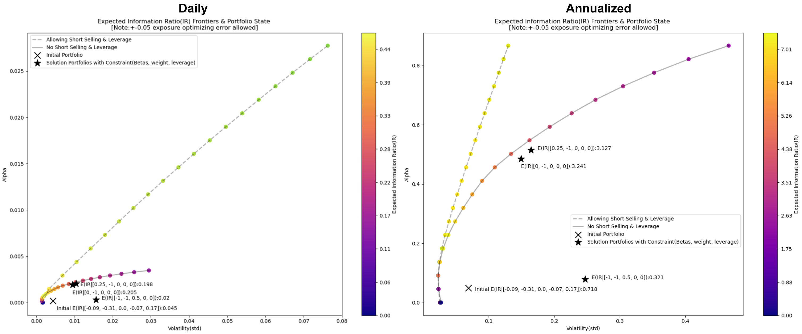
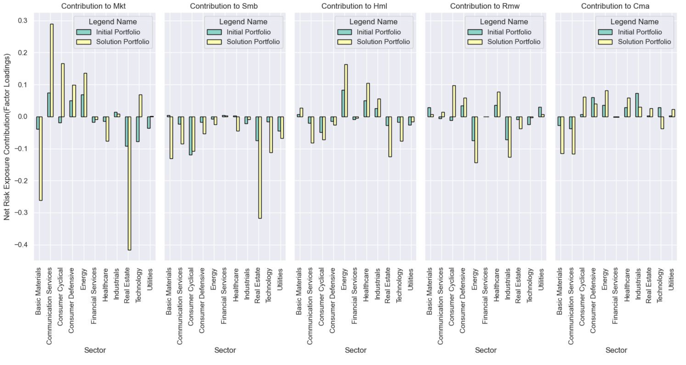
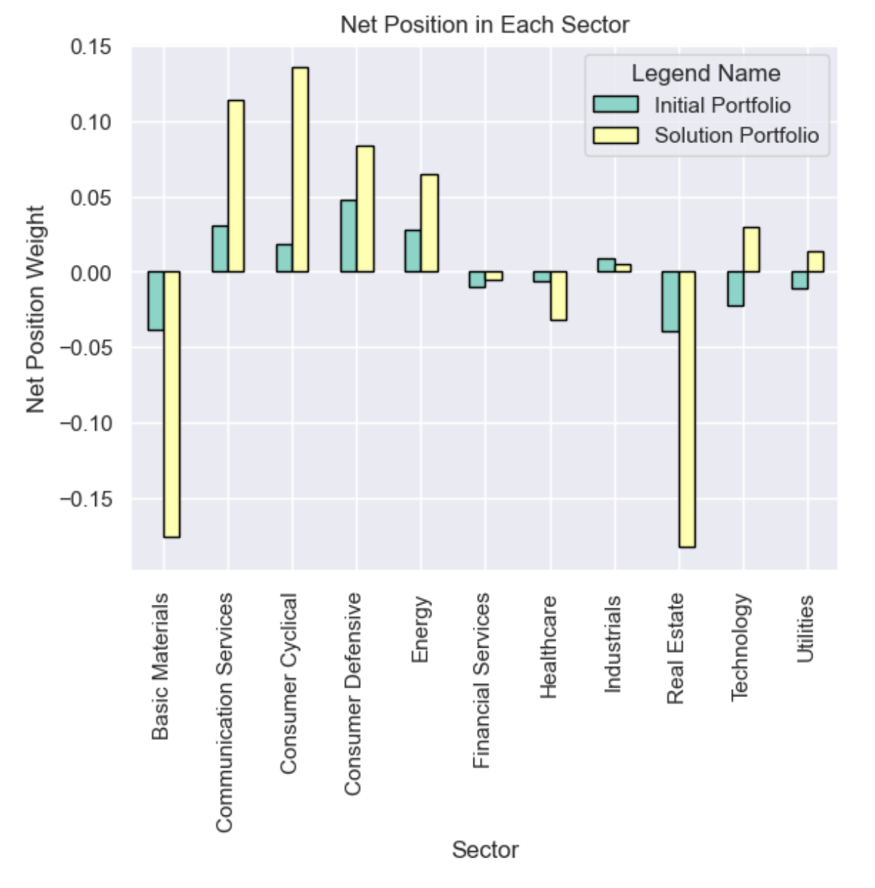

# A Long/Short Hedge Fund: Constrained Portfolio Optimization & Rebalancing Solution

### Motivation

A hedge fund needs to optimize and rebalance its portfolio based on both strategy and constraints, including:
- Recent State: current weights for each asset
- Risk exposure constraints
- Weight constraints
  - Some stocks/sectors should have positive/negative weight
  - Internal compliance on maximum, and minimum weights
- Strategy constraints
- Cash holdings constraints

Key questions:
- How to generate a solution?
- How to generate a better solution?

### Scenario

As future quantitative hedge fund managers, we may need to adjust our portfolio based on forecasted economic trends. Short-term risks can be hedged using derivatives, but long-term adjustments are necessary to align with incoming macroeconomic conditions. The goal is to adjust the portfolio to exploit these opportunities while adhering to internal compliance rules.

Suppose there are five factors (as described by the Fama-French 5-factor model) in the market, with the following forecasted trends over the next 3 years:
- F1: Unknown
- F2: Negative
- F3: Unknown
- F4: Unknown
- F5: Unknown

### Solution

We aim to have a portfolio that is insensitive to F1, F3, F4, F5 but has a negative β2, the portfolio’s factor loading to F2.

### Problem Formulation

    **Objective Function:**
    - Information ratio: A measure of the risk-adjusted returns of a financial asset or portfolio relative to a benchmark
    - Transaction cost
    - Tax expense

    **Constraints:**
    - Risk exposure constraints: keep certain βs low but increase exposure to certain risks/factors
    - Strategy constraints: As a hedge fund employing a long/short strategy, short overvalued stocks and long undervalued stocks in the same sector
    - Weight constraints: For internal compliance, e.g., no weight can be greater than 0.05 or lower than -0.05
    - Cash holdings constraints: Avoid redundant capital usage and preserve cash for future margin calls

    **Recent State:**
    - Current weights for each asset

### Methodology

1. **Model Selection:** Fama-French 5 Factors
2. **Data Collection:**
    - Download recent portfolio weights in each stock (ex. OpenPosition_11_29_2023.csv). 
    - Use API and web scraping to collect information related to each stocks(such as sector classification).
    - Creating dataframe by merging the information from the previous two steps, generating:
        - Portfolio_betas.csv: Stock symbols, company names, shares held, trading currency, latest trading price, purchase price, factor coefficients
        - Portfolio_residuals.csv: Daily factor model residuals for 99 companies from 2021/12/06 to 2023/10/30

    **Data Sources:**
    - CQA challenge UCSD Team 1 portfolio
    - Yahoo Finance Stock Data: Adjusted Return
    - Scraping Yahoo Finance Stock Profile: Sector
    - Kenneth R. French - Fama/French 5 Research Factors (2x3)

3. **Pre-Optimization Analysis:**
    - Analyze the distribution of factor loadings, alphas, sector distribution, and residuals

4. **Optimization**
    
    - Define Objective Function
    - Create constraints such as those related to betas, weights of each stock, and the long/short ratio
    - Compute the portfolio's initial state
    - Maximize the objective function with the given constraints

5. **Post-Optimization Analysis:**
    - Comparing factor loadings, alphas, sector distribution, and residuals.
    - Visualizing the properties of the solution.
    - If there is unwanted weights or factor loadings contribution concentration (sector, asset), we can impose new constraints in our optimization algorithms.
    

### EDA

#### Distribution of Factor Loadings (Each Asset)
Before optimization, we should delve into EDA, to realize the styles of each asset, that is to say, the factors loadings distribution of our asset.

#### Distribution of Alphas (Each Asset)
The EDA should also include an analysis of the alpha of each asset.

#### Distribution of Sector (Each Asset)
We also have to delve into the weight distribution in each sector.

#### Factor Model Residuals’ Attributes
For this example, we can find out that even using FF5 risk models, there are still roughly 60% of stock return variation unexplained. This is where our optimization algorithm can help, increasing the information ratio based on the covariance matrix of residuals.

### Optimization and Rebalancing Strategy
#### Weight of Each Asset (Before and After)
This graph showcases the recommended weight adjustment based on our algorithms.

#### Expected Alpha and Volatility (Daily and Annualized)
This graph showcases the given constraints on weights, sector weights, factor loadings, and the expected performance of our solutions compared to the original portfolios.

#### Contribution of Each Position to Portfolio Risk Exposures
This graph gives a visualization of before/after factor loading contribution from each stock so that we can realize whether we depend on only several or overweight several stocks to get desired factor loadings.

#### Contribution of Each Sector to Portfolio Risk Exposures
In the same way, through this visualization, we can realize whether we overweight several sectors to gain desired exposure to certain risk factors.

#### Weights of Each Sector (Before and After)
We also have to investigate the weights in each sector in these recommended portfolios. If we think there are inappropriate allocations, we can impose constraints on our optimizer accordingly.

### Group Members
- Justin Yu-Chi Hsu
- Qisong Li
- Lei Jiang
- Yu Zhang

### References

1. [Information Ratio Definition](https://corporatefinanceinstitute.com/resources/career-map/sell-side/capital-markets/information-ratio/)
2. [Fama French Five Factor](https://mba.tuck.dartmouth.edu/pages/faculty/ken.french/Data_Library/f-f_5_factors_2x3.html)
3. [Scipy Optimization Document](https://docs.scipy.org/doc/scipy/reference/optimize.minimize-slsqp.html)
4. [Yahoo Finance Stock Data](https://finance.yahoo.com/quote/AAPL/profile?p=AAPL)

---

This project is a comprehensive analysis and solution for optimizing and rebalancing a long/short hedge fund portfolio, incorporating strategy, risk management, and compliance constraints.
